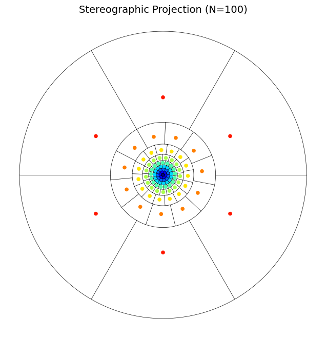

# Visualization & Illustration Guide

PyEQSP provides powerful tools for visualizing partitions and point sets in both 2D and 3D.

## Simple 2D Illustrations

For quick analysis, 2D projections of the EQ algorithm are highly effective. The standard illustration shows how the sphere is partitioned into collars and regions.

### Standard 2D Projection
The `eqsp.illustrations` module provides functions to visualize the resulting partitions in common projections.

```python
import matplotlib.pyplot as plt
from eqsp import illustrations

# Show a stereographic projection of 100 regions on S2
plt.figure(figsize=(8, 8))
illustrations.project_s2_partition(100, proj='stereo', show_points=True)
plt.show()
```

> [!TIP]
> For a clean, executable version of this plot, see [examples/user-guide/src/example_visualize_2d.py](https://github.com/penguian/pyeqsp/blob/main/examples/user-guide/src/example_visualize_2d.py).



## Interactive 3D Visualizations

To truly understand the geometry of a partition or to inspect point sets on $S^2$ and $S^3$, PyEQSP leverages **Mayavi** for interactive 3D rendering.

### Partitioned Spheres
You can rotate, zoom, and inspect the individual regions of a partition in 3D space.

```python
from eqsp import visualizations

# Show a 3D partition of 100 regions with centre points
visualizations.show_s2_partition(100, show_points=True)
```

> [!TIP]
> The interactive 3D script, including environment checks for Mayavi, is available at [examples/user-guide/src/example_visualize_3d.py](https://github.com/penguian/pyeqsp/blob/main/examples/user-guide/src/example_visualize_3d.py).


## Advanced Projections

For specific research or mapping needs, the library also supports more advanced projections via `eqsp.illustrations.project_s2_partition`.

*   **Mollweide**: Equal-area projection of the entire sphere.
*   **Lambert**: Azimuthal equal-area projection.
*   **Polar**: For focusing on the North/South poles.

## Jupyter Integration

PyEQSP is designed to work seamlessly in Jupyter Notebooks.
- **Inline Matplotlib**: Use `%matplotlib inline` for static plots.
- **Interactive Widgets**: Use `%matplotlib widget` for interactive research. Mayavi can be configured via `mlab.init_notebook()`.
